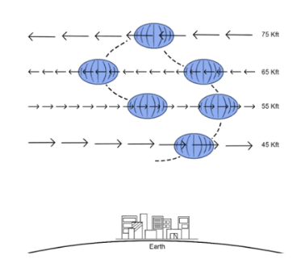
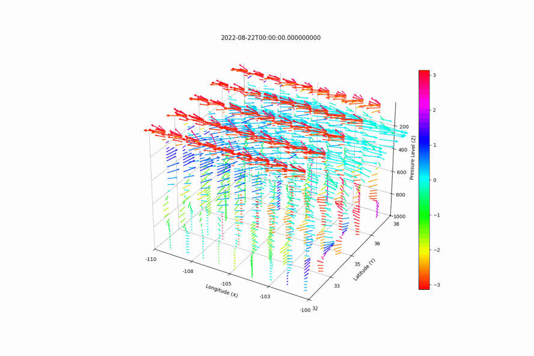
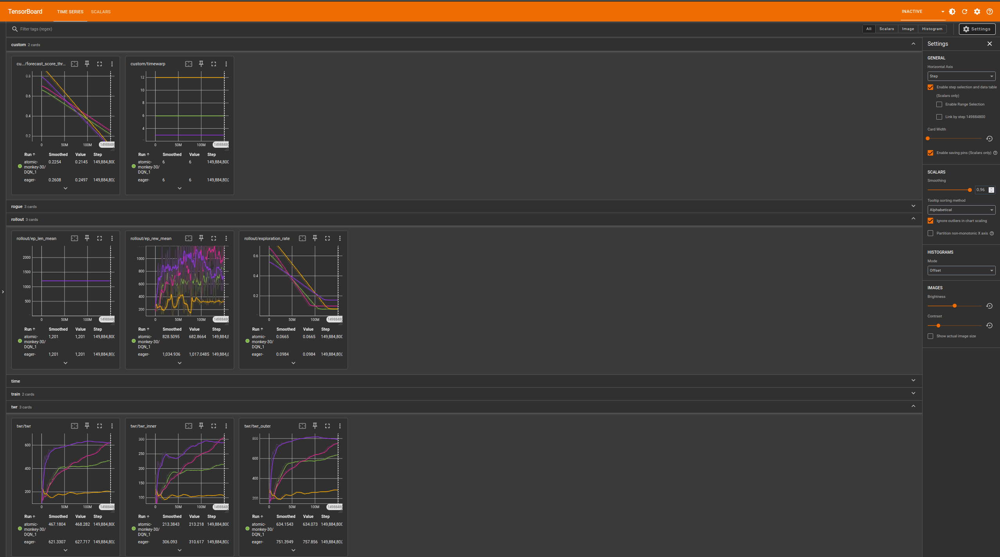
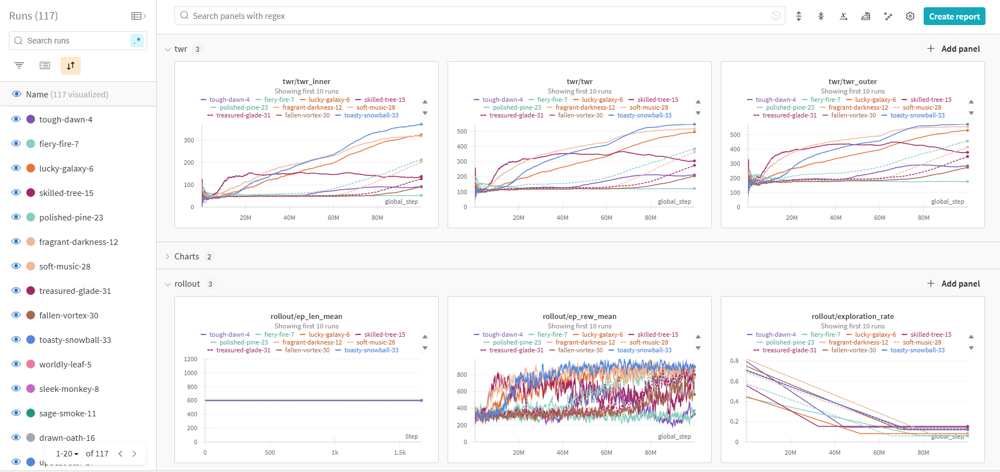
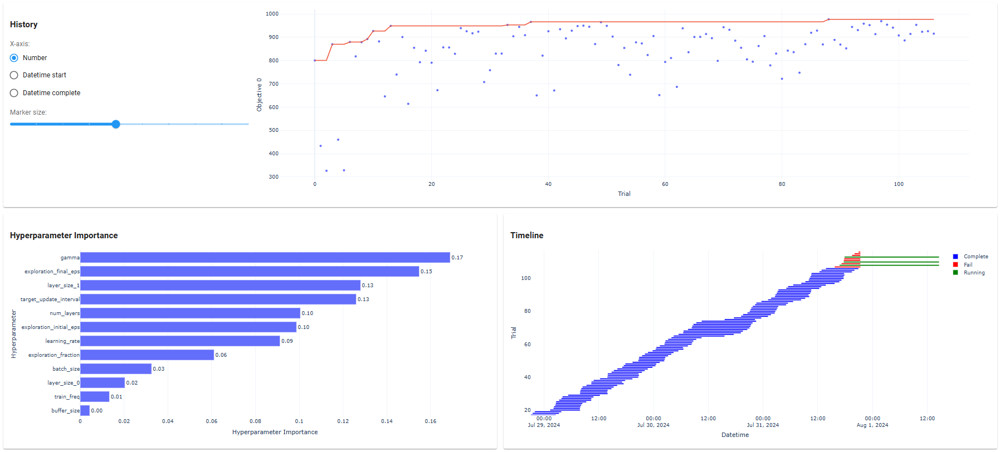

[](https://www.python.org/downloads/release/python-390/)

# RL-HAB

RL-HAB is a high altitude balloon (HAB) simulation environment for training altitude controllable agents using reinforcement learning. The simulator is wrapped 
in the standard [gynmasium](https://gymnasium.farama.org/) structure for training agents with classic open-source reinforcement learning libraries
such as [stabe-baselines-3](https://stable-baselines3.readthedocs.io/en/master/), [clearnrl](https://docs.cleanrl.dev/), 
and [RLlib](https://docs.ray.io/en/latest/rllib/index.html). We provide examples of training and evaluating agents with 
DQN in stable-baselines-3.  We also provide optional integration of wandb for training and optuna for automated hyperparameter 
tuning and analysis.


Altitude controllable high altitude balloons can strategically move up and down to different levels of the atmosphere to leverage changes in winds for limited horizontal control. A typical phenomenon that occurs in the atmosphere is opposing winds, where winds are moving in opposite directions at two different altitudes. 
HABs can leverage opposing winds to perform station keeping maneuvers for persistent area coverage of a 
target region over a time period of hours, days, or weeks, which can help with surveillance, in-situ stratospheric meteorological 
data collection, and/or communication relays.  With perfect weather forecasts
this would be a simple deterministic path planning problem, however forecasts frequently have large errors in wind direction (occasionally up to 180 degrees off) 
and also lack vertical and temporal resolution in the altitude region of interest, leading to significant 
uncertainty in dynamic flow fields.  Additionally, wind diversity and opposing wind probabilities follow seasonal and geographical/hemispherical trends throughout the year. See ["Wind Diversity Trends in the Lower Stratosphere Analyzed from Radiosondes launched in the Western Hemisphere"](https://essopenarchive.org/doi/full/10.22541/essoar.173655479.95219548) for more information on these global trends. 

Google Loon was the first to [demonstrate station-keeping using deep reinforcement learning](https://www.nature.com/articles/s41586-020-2939-8) and have open-sourced their simulation enviroment, ["Balloon Learning Environment (BLE)"](https://balloon-learning-environment.readthedocs.io/en/latest/). 

Major Differences between BLE and RL-HAB:
  * BLE uses a variational autoencoder (VAE) for generating unique dynamic forecasts for training, and adds simplex noise to balloon dynamics. RL-HAB uses ERA5 Reanalysis as the "forecast" and synthetic forecasts (See /SynthWinds) generated from agreggated radiosonde data as ground truth.
  * BLE assumes SP balloon dynamics and resource constraints. RL-HAB uses simplified Solar Balloon dynamics without resource constraints.
  * RL-HAB evaluation is by month and region rather than overall evaluation like in BLE.
    * BLE does an overall evaluation on the same "region and time period" (although forecasts are coming from a pre-trained vae not included in the codebase). BLE includes different evaluation suites as well as *strata_seed* options which can be a "natural distribution" (typical atmospheric condition frequencies like in suites tiny, small, medium, big)) and "even distribution" (equal number of hard, medium, easy station-keeping like in suites all_strata). 
  * BLE includes deterministic StationSeeker controller, we included an even simpler baseline controller.


<!---
 
-->

## Installation

1. ### Install [Anaconda3](https://www.anaconda.com/download)
    If your machine has a GPU, you can additionally install [GPU support](https://www.anaconda.com/blog/getting-started-with-gpu-computing-in-anaconda).

2. ### Install Python Dependencies

    For easy install on WSL and Ubuntu use:
    ```
    pip install -r requirements.txt
    ```

    Setup RL-HAB Environment:   
    ```
    pip3 install -e .
    ```
    
    Tested to work on Windows 11 WSL with the following:
    * Ubuntu 22.04
    * Python Version 3.11
    * Conda Version 23.7.4
  

##  Quickstart
Use the provided configuration file, formatted ERA5 forecast, synthetic forecast, and example trained model for evaluation. 

See Docs for more detailed explanations on how to aqquire and format forecasts, update dynamics, change parameters, etc. 


### Evaluate Pre-Trained Model or baseline controller
This is an example of evaluating a DUAL (ERA5 reanalysis observation, SYNTHetic forecast for movement) pre-trainined model. Optionally set `render_mode='human'` in `env_config.py` for visualization.  Complete ERA5 reanalysis forecast data is provided for 2023 North America Region, as well as Jan and July Synth winds, and a model trained in the month of Jul and Jan.  

To try different evaluations update *synth_netcdf* and *model_name* in `env_config.py`.

> **ℹ️ Note** Number of levels for the observation forecast must be equivelent across trainings and evaluations. For this example, and example Complete ERA5 reanalysis netcdf forecast for the USA region in 2023 was processed and reformatted using [ERA5-Utils](https://github.com/tkschuler/ERA5-Utils). 

  > python3 evaluation/evaluate.py

  > python3 env/baseline_controller.py

### Train a New Model
Complete and Pressure ERA5 reanalysis forecast data is provided for 2023 North America Region, as well as Jan and July Synth winds.

  > python3 env/train-DQN.py

To monitor the status of the model learning in realtime with tensorboard:

  > tensorboard log_dir logs_DUAL-Test



<!---
##  Train and Evaluate RL HAB Agents

    **ToDo**  Discuss Forecast Processing. How to Download from ECWMF Copernicus etc

    **ToDo**  Discuss SynthWinds,  is this a seperate Repo?

### Setup Environment
Set enviromental parameters in **env.config.env_config.py**

### Training an Agent
Follow **train-DQN.py** as an example of how to train an agent.

    **ToDo**  Add options for simulating time skips with synth winds

    **ToDo** Add options for different motion profiles,  kinematics, noise, etc. 

    **ToDo**  Should We setup different Config files for different variations on the environment?

    **ToDo**  Should We seperate the reward functions?


The *config dictionary* within the script can be updated with various hyperparemters, training runtime, and other customizations

#### Reccommended Configuration, Hyperparameters and Reward Structure:
* Kinematics Motion Model
* Total Train time of 100 mil steps
* Radius of 50 km
* Randomly change flow every episode (*random_flow_episode_length* of 1)
* See *hyperparemters dictionary* within **train-DQN.py** for a starting point
* Euclidian reward structure (This can me changed in the *step function* of **FlowEnv3D_SK_relative.py** 
  or **FlowEnv3D_SK_relative_kinematics.py**. Currently set to *reward_euclidian*)


### Evaluating an Agent
Once training is complete, run **evaluate_\*.py** as an example of how to evaluate a trained agent. This script also provides 
an example of rendering the path of trained agents. 

Below shows an example of statistics tracked in wandb when running multiple experiments with varrying hyperparemters.


-->

## Preparing Forecasts for Simulation
  See Docs


## Hyperparameter Tuning and Optimization with [Optuna](https://optuna.org/)

There are 2 examples of how to run optuna hyperparameter tuning sessions.  

```optuna_config.py``` sets up several high level variables that the other scripts use. 
This includes the project name, and model and logs storing directories.  ```n_envs``` is how many vectorized envs to run
see (https://stable-baselines.readthedocs.io/en/master/guide/examples.html) as an example. ```n_threads``` specifies 
how many virtual threaded versions of the script to run (equivelent to running the same script in N terminal windows). ```n_trials``` 
specifies how many trials to complete until the study is finished.  If running multi threaded, this will be ```n_trials```*```n_threads```

To initialize the hyperparmeter study and an optuna database file to store any analyzed data from, first run 

```initialize_study.py```

Then either run ```optuna-multi-DUAL.py``` or ```optuna-multi-Single.py``` to 
run one session individually,  or ```optuna-multi-*.py``` to run multiple threads at a time. 

If running a multi threaded case be aware that there is a limit to computation power, start small and ramp up.  There is a point 
where too many threads actually makes the simulation run slower and is less efficient; however this is different for every machine. 

To see hyperparmeter results and plots on web, run:

    optuna-dashboard sqlite:///db.sqlite3

Some example output from hyperparameter tuning with Optuna:


## Notes/Discussion
   * **Important notes on seeding:**
        * Specifying a seed in ```np.random.seed(seed)``` at the top level of a script will produce the same order of random numbers everytime
          ```np.random``` is called. If using multiple threads/processes,  the random numbers generated will not be identical across the multiple processes, 
          burt the random numbers in each process will be the same everytime the script is run.
        * To have the same random numbers be generated across multiple threads/processes we have to set a seed for random 
          number generation```self.np_random = np.random.default_rng(seed)``` and then use ```self.np_random``` everywhere in place of ```np.random```
        * SB3 model decleration also takes an optional seed variable.  If a seed is specified,  the same random actions will be taken everytime. We typically don't want this.   
   * CPU and GPU are about equal in training time
   * Simulation updates/variations to implement/try to improve learning performance:
      * Kinematics vs. no Kinematics
      * Different reward structures
      * Limit control frequency  (currently every step)
      * Change observation space
        * Add or remove dimensions
        * Change to local coordinates (distance/bearing)
        * Change structure of "flow map"

## Authors
* **Tristan Schuler** - *U.S. Naval Research Laboratory*
* **Chinthan Prasad** - *U.S. Naval Research Laboratory*
* **Georgiy Kiselev** - *U.S. Naval Research Laboratory (NREIP Intern)*

Testing 