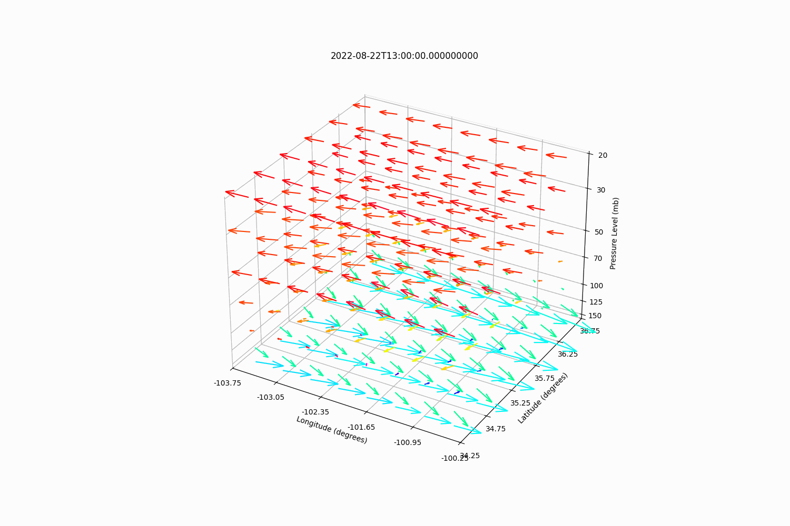
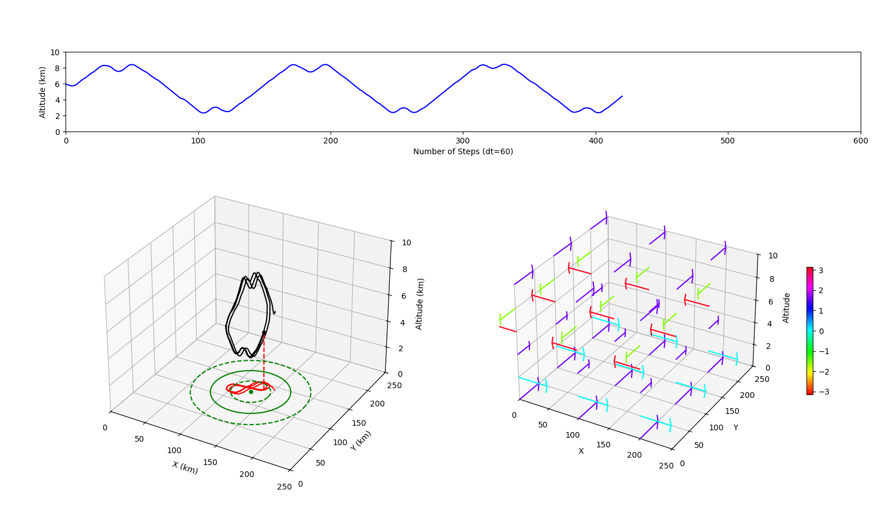
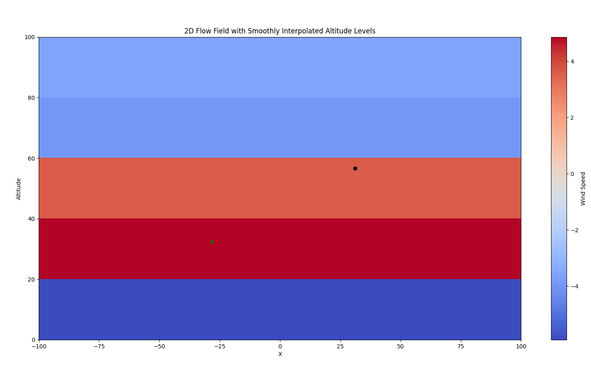
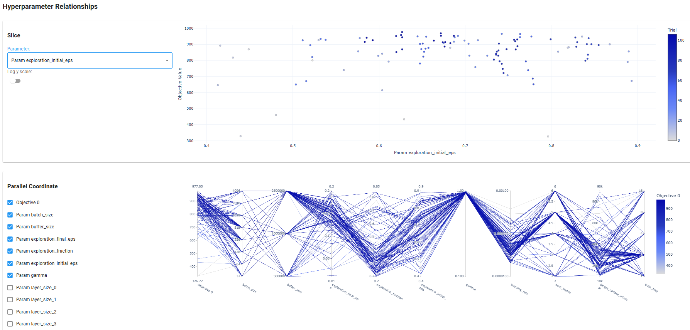

[](https://www.python.org/downloads/release/python-390/)

# RL-HAB

RL-HAB is a high altitude balloon (HAB) reinforcement learning simulation environment for training agents. The simulator is wrapped 
in the standard [gynmasium](https://gymnasium.farama.org/) structure for training agents with classic open-source reinforcement learning libraries
such as [stabe-baselines-3](https://stable-baselines3.readthedocs.io/en/master/), [clearnrl](https://docs.cleanrl.dev/), 
and [RLlib](https://docs.ray.io/en/latest/rllib/index.html). We provide examples of training and evaluating agents with 
DQN in stable-baselines-3.  This package also include optional integration of wandb and optuna for automated hyperparameter 
tuning and analysis.


These enviorments are inspired by high altitude balloons that can only actuate up and down but then leverage changes in winds at various altitudes to
have limited horizontal control

HABs can leverage opposing winds to perform station keeping maneuvers for persistent area coverage of a 
target region over a time period of hours, days, or weeks, which can help with surveillance, in-situ stratospheric meteorological 
data collection, or communication relays.  With a perfect weather forecast
this would be a simple deterministic path planning problem, however forecasts frequently have large errors in wind direction (occasionally up to 180 degrees) 
and also lack vertical and temporal resolution in the altitude region of interest (typically only 5-10 data points for a 10 km region), leading to significant 
uncertainty in flow fields.  Additionally, wind diversity and opposing wind probabilities follow seasonal and geographical/hemispherical trends throughout the year.


Also see Google's Balloon Learning Environment: https://balloon-learning-environment.readthedocs.io/en/latest/


 

## Installation

1. ### Install [Anaconda3](https://www.anaconda.com/download)
    Conda virtual environments are preferred for machine learning projects where dependency version numbers are very important, and might vary from one package to another.

    If your machine has a GPU, you can additionally install [GPU support](https://www.anaconda.com/blog/getting-started-with-gpu-computing-in-anaconda)

2. ### Install Python Dependencies
    Setup Environment:   
    ```
    pip3 install -e .
    ```

    For easy install on WSL and Ubuntu use:
    ```
    pip install -r requirements.txt
    ```
    
    Tested to work on Windows 11 WSL with the following:
    * Python Version 3.12
    * Conda Version 23.7.4
   
3. Make a Wandb Account and set up on your local machine 
   https://docs.wandb.ai/quickstart
   

##  Train and Evaluate RL HAB Agents



### Simulated Flow Field
For now, flowfields are simulated with **generate3Dflow.py**.  The script generates a vector field with constant flows in the XY plane at 
a user-defined number of altitude levels. The flow directions are randomized between 0, 90, 180, and 270 degrees. The magnitudes are 
randomized from 5 to 25 m/s.  

**ToDo**  We need more complex flow fields to train on in the future. 

### Setup Environment
Set enviromental parameters in **env3d.config.env_config.py**

### Training an Agent
Follow **train-DQN.py** as an example of how to train an agent.

In the imports section, decide between kinematics vs discrete altitude control by importing **FlowEnv3D_SK_relative.py** or **FlowEnv3D_SK_relative_kinematics.py**

The *config dictionary* within the script can be updated with various hyperparemters, training runtime, and other customizations

#### Reccommended Configuration, Hyperparameters and Reward Structure:
* Kinematics Motion Model
* Total Train time of 100 mil steps
* Radius of 50 km
* Randomly change flow every episode (*random_flow_episode_length* of 1)
* See *hyperparemters dictionary* within **train-DQN.py** for a starting point
* Euclidian reward structure (This can me changed in the *step function* of **FlowEnv3D_SK_relative.py** 
  or **FlowEnv3D_SK_relative_kinematics.py**. Currently set to *reward_euclidian*)


### Evaluating an Agent
Once training is complete, run **evaluate_DQN.py** as an example of how to evaluate a trained agent. This script also provides 
an example of rendering the path of trained agents. 

Below shows an example of statistics tracked in wandb when running multiple experiments with varrying hyperparemters.


### env2d (Archived)



### Hyperparameter Tuning with Optuna
    TODO: write some documentation for this

Some example output from hyperparameter tuning with Optuna:



## Notes/Discussion
   * **Important notes on seeding:**
        * Specifying a seed in ```np.random.seed(seed)``` at the top level of a script will produce the same order of random numbers everytime
          ```np.random``` is called. If using multiple threads/processes,  the random numbers generated will not be identical across the multiple processes, 
          burt the random numbers in each process will be the same everytime the script is run.
        * To have the same random numbers be generated across multiple threads/processes we have to set a seed for random 
          number generation```self.np_random = np.random.default_rng(seed)``` and then use ```self.np_random``` everywhere in place of ```np.random```
        * SB3 model decleration also takes an optional seed variable.  If a seed is specified,  the same random actions will be taken everytime. We typically don't want this.   
   * CPU is faster for training then GPU right now with how simple the physics simulation is
   * Simulation updates/variations to implement/try to improve learning performance:
      * Kinematics vs. no Kinematics
      * Different reward structures
      * Limit control frequency  (currently every step)
      * Change observation space
        * Add or remove dimensions
        * CHange to local coordinates (distance/bearing)
        * Change structure of "flow map"
    
## Future/TODO
   * Time varrying flow fields
   * Generate flow fields from netcdf4 forecasts (historical ERA5)
        * Generate netcdf4 "forecasts" from radiosonde data
   * Generate flow fields to mimic fan flow fields in the high bay with blimps
        * Determine Fan thrust decay rate as wel as turbulence when there are multiple fans 
   * Update simulation environment and kinematics to match HABS
        * Vertical ascent/descent profile
        * Atmospheric changes (tempr, pressure, cloud coverage, solar radiation)  
        * Power usage, solar charging 
        * air drag for horizontal motion
        * burst or loss of lift conditions
        * altitude constraints (flying too low)

## Authors
* **Tristan Schuler** - *U.S. Naval Research Laboratory*
* **Chinthan Prasad** - *U.S. Naval Research Laboratory*
* **Georgiy Kiselev** - *U.S. Naval Research Laboratory NREIP Intern*