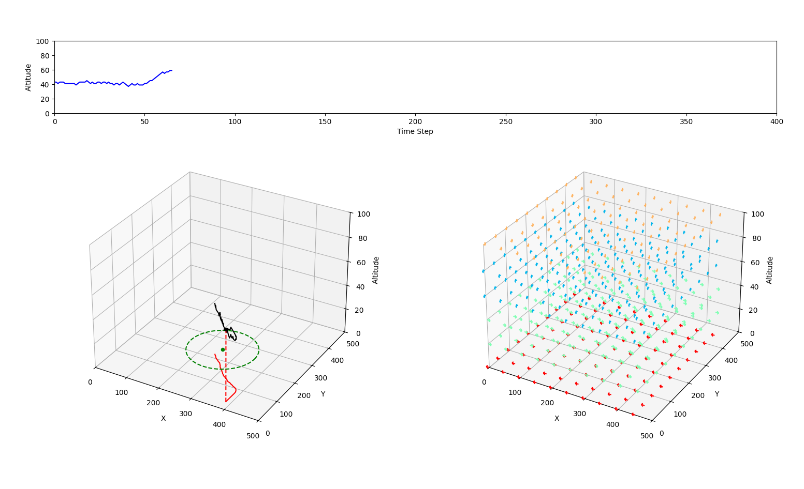

[](https://www.python.org/downloads/release/python-390/)

# FLOW2D

FLOW2D provides custom physics-based simulation environments (in the standard gym structure) for testing path planning algorithms. 
This includes a simplified 2D target reaching simulation with horizontal flow bands, as well as a 3D station keeping environment.  

These enviorments are inspired by high altitude balloons that can only actuate up and down but then leverage changes in winds at various altitudes to
have limited horizontal control

Also see Google's Balloon Learning Environment: https://balloon-learning-environment.readthedocs.io/en/latest/


## Installation

1. ### Install [Anaconda3](https://www.anaconda.com/download)
    Conda virtual environments are preferred for machine learning projects where dependency version numbers are very important, and might vary from one package to another.

    If your machine has a GPU, you can additionally install [GPU support](https://www.anaconda.com/blog/getting-started-with-gpu-computing-in-anaconda)

2. ### Install Python Dependencies
    Setup Environment:   
    ```
    pip3 install -e .
    ```

    For easy install on WSL and Ubuntu use:
    ```
    pip install -r requirements.txt
    ```
    
    Tested to work on Windows 11 WSL with the following:
    * Python Version 3.12
    * Conda Version 23.7.4
   
3. Make a Wandb Account and set up on your local machine 
   https://docs.wandb.ai/quickstart
    

## Running Reinforcement Learning Simulations

Run scripts from the main Flow2D directory

### env3d
   

   **generate3Dflow.py** - is how we currently develop 3D horizontal flows at various altitudes in the XY plane

   **FlowEnv3D.py** -  has no kinematics (only up/down 2 units at a time) and instanteneous flow velocity. Goal is to reach goal in 3D.

   **FlowEnv3Dstationkeping.py** - similar to FlowEnv3D, but now the goal is a cylindrical radius to stay with instead of a point

   *Note* The reset method for FlowEnv3D.py and FlowEnv3Dstationkeping.py has options to switch between static flow, gradually updating the flow every episode, and randomizing the flow every episode within specified directional bins

   **train-\*.py** gives examples of how to train a stationkeeping agent using StableBaselines3 and wandb

   **evaluate2d.py** gives examples of how evaulate a 3D trained stationkeeping agent using StableBaselines3 
### env2d
   
   
   **FlowEnv2D.py** - has no kinematics (only up/down 2 units at a time) and instanteneous flow velocity. The flow is randomly generated each episode
   
   **FlowEnv2DSTATIC.py** - similar to *FlowEnv2D.py*, but with the same flow every episode
   
   **RRT2D.py** gives an example of solving the path planning problem using RRT
   
   **train-\*.py** gives examples of how to train an agent using StableBaselines3 in the various 2D environments, with or without wandb

   **evaluate2d.py** gives examples of how evaulate a 2D trained agent using StableBaselines3 


### Hyperparameter Tuning with Optuna
    TODO: write some documentation for this

## Notes/Discussion
   * **Important notes on seeding:**
        * Specifying a seed in ```np.random.seed(seed)``` at the top level of a script will produce the same order of random numbers everytime
          ```np.random``` is called. If using multiple threads/processes,  the random numbers generated will not be identical across the multiple processes, 
          burt the random numbers in each process will be the same everytime the script is run.
        * To have the same random numbers be generated across multiple threads/processes we have to set a seed for random 
          number generation```self.np_random = np.random.default_rng(seed)``` and then use ```self.np_random``` everywhere in place of ```np.random```
        * SB3 model decleration also takes an optional seed variable.  If a seed is specified,  the same random actions will be taken everytime. We typically don't want this.   
   * CPU is faster for training then GPU right now with how simple the physics simulation is  
   * Chinthan's Branch has examples with of the enviorments with kinematics added in
   * The 2D environment gets caught in local minima and only reaches the taget about 75% of the time. 
   * The current 3D station keeping environment is good at training agents to station keep with STATIC flowfields.  
      * We do not have success with graudally or fully randomizing flow generations each eipsode.
   * Simulation updates/variations to implement/try to improve learning performance:
      * Kinematics vs. no Kinematics
      * Different reward structures
      * Limit control frequency  (currently every step)
      * Change observation space
        * Add or remove dimensions
        * CHange to local coordinates (distance/bearing)
        * Change structure of "flow map"
    
## Future/TODO
   * Time varrying flow fields
   * Generate flow fields from netcdf4 forecasts (historical ERA5)
        * Generate netcdf4 "forecasts" from radiosonde data
   * Generate flow fields to mimic fan flow fields in the high bay with blimps
        * Determine Fan thrust decay rate as wel as turbulence when there are multiple fans 
   * Update simulation environment and kinematics to match HABS
        * Vertical ascent/descent profile
        * Atmospheric changes (tempr, pressure, cloud coverage, solar radiation)  
        * Power usage, solar charging 
        * air drag for horizontal motion
        * burst or loss of lift conditions
        * altitude constraints (flying too low)

## Authors
* **Tristan Schuler** - *U.S. Naval Research Laboratory*
* **Chinthan Prasad** - *U.S. Naval Research Laboratory*