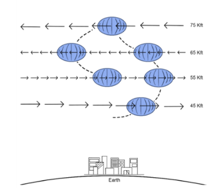
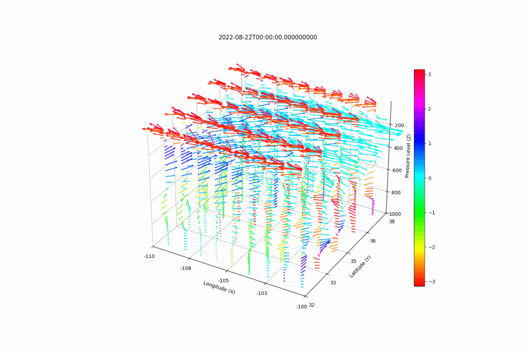

About RL HAB
=================
High-altitude aerial platforms are typically flown in the stratosphere at heights between
18 to 50 km, above traditional commercial air traffic. Additionally, since the stratosphere
is a layer where the vertical temperature has a positive lapse rate due to solar radiation
absorption by Ozone and other gases, vertical air mixing tends to be suppressed and generally
turbulence and wind speeds are lower in stratosphere than in the troposphere. High Altitude
balloons (HABs) and to a lesser extent, high-altitude gliders, can utilize varying winds in
the stratosphere to perform station-keeping and other trajectory following maneuvers by changing
altitude, as shown in Figure below.  Google Loon and Aerostar have demonstrated horizontal
control ability of long-duration altitude adjustable super pressure balloons by leveraging
opposing winds in the lower stratosphere using deep reinforcement learning to suggest
optimum heights.

Altitude Controlled High Altitude Balloons
___________________________________________
There are many different types of altitude controlled balloons that have significantly different
lifespans and altitude control mechanisms.  Hot air balloons were the first platform to
demonstrate altitude control by changing the internal air temperature via a combination of
parachute venting and generating heat at the base of the balloon to adjust buoyancy; however,
hot air balloons typically only fly in the lower troposphere. Solar high altitude
balloons (SHABs), which are heated by solar radiation from the sun, have performed altitude
maneuvers in the stratosphere with the integration of mechanical vents. Super pressure
balloons are the most common HAB platform altitude maneuvering in the stratosphere and
typically rely on one or more of the following for their altitude control mechanisms: air
ballast, pumped helium or "differential expansion", and mechanical compression.

Many commercial companies such as Aerostar (which produced Google Loon balloons), and
WorldView deploy air ballast super pressure balloons that contain an internal membrane
which pumps atmospheric air into the balloon to adjust the buoyancy. Differential expansion
balloons consists of a super pressure balloon and zero-pressure balloon connected via a gas
transfer device (e.g., pump and valve that regulate the distribution of the lift gas).
Other researchers have used variations of these two techniques with latex weather balloons
as well with a combination of pumping air or lighter-than-air gas and dropping ballast for
altitude control. An additional altitude controlled mechanism for super pressure balloons
is mechanical compression by means of a winch or other constriction device. Altitude controlled
balloons leveraging winds for navigation have also been proposed for exploring Mars, Venus, and
Titan

In RLHAB we use solar high altitude balloons (SHAB-Vs) as our reference balloon dynamics.

.. image:: ../../img/SHAB-V.png

Winds in the Stratosphere
___________________________________________
Wind diversity in the stratosphere is directly linked to the climatology of the stratosphere.
The stratosphere is much less dynamic than the troposphere which is rich in water vapor, clouds,
and weather and variability in the circulation of the stratosphere is characterized by timescales
considerably longer than those observed in the troposphere.Climatological patterns of the stratospheric
are affected by the annual migration of the sun in the subtropics and polar regions and to a much
lesser extent by the semi-annual migration of the sun in the near
equatorial regions.

Winds in the lower stratospheric are highly dynamic but follow several regional and temporal
trends.  These trends can assist with high-level mission planning and long term path planning for
altitude-controlled high-altitude aerial platforms which requires strong wind diversity for
maneuvering (e.g., HABs) or desire calm winds (e.g., solar gliders). Overall, higher wind diversity
probabilities tend to follow the summer season for each hemisphere respectively, except for in the
tropics around the equator, where wind diversity is high year round.  Opposing wind probabilities
tend to oscillate up from southern South America in December-March to the Continental United States
in May-September and then back down. Opposing winds have the highest variation in seasonal transition
months of March and April in the Northern Hemisphere, and October and November in the Southern
Hemisphere.  This result is promising for high level mission planning of high altitude platforms;
regions and seasons with weak or strong opposing wind probabilities can be estimated with greater
confidence. Calm winds also more frequently form in the summer months and oscillate between each
hemisphere respectively, although in a smaller latitudinal and altitude range than opposing winds.

For more detailed information about wind diversity trends with respects to HABS, please see (cite Paper when
published)

.. image:: ../../img/opposing-winds-western-hemisphere-2023.gif
   :align: center

Station Keeping
___________________________________________
Opposing winds (when winds flow in opposite directions at different altitudes) is the simplest
condition for station keeping with HABS. With more diverse winds, more complex manuvers are
possible. At each time step, the HAB can perform three discrete actions: ascend,
maintain altitude, or descend.  A HAB is considered sucessfully station keeping if the horizontal
motion of the HAB stays within a specified radius around a coordinate (typically 50 km).

.. image:: ../../img/simulator.gif